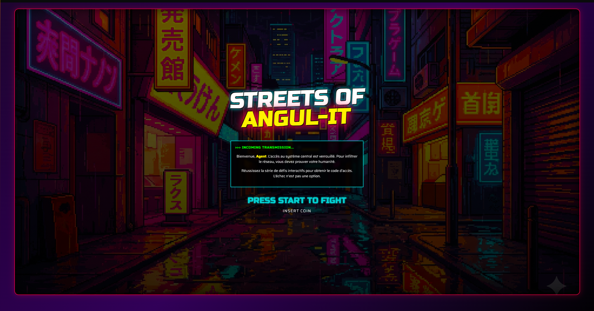

# 🕹️ STREETS OF ANGUL-IT



> **> SYSTÈME VERROUILLÉ.**
> **> VÉRIFICATION D'IDENTITÉ REQUISE.**
> **> INSERT COIN TO START.**


## 👾 LA MISSION

Bienvenue, Agent. Le réseau **Angul-It** a été compromis.
Pour accéder au tableau des scores, vous devez prouver que vous n'êtes pas un robot à travers une série de défis interactifs.

Ce projet n'est pas un simple formulaire. C'est une expérience **Arcade** complète.

---

## 🥊 CARACTÉRISTIQUES (COMBO LIST)

* **🌌 Univers Immersif :** Design "Street of Rage" / Cyberpunk, animations CSS fluides et interface responsive.
* **🔄 Boucle de Jeu Infinie :**
    * Niveaux 1 & 2 : Identification visuelle (Grille d'images).
    * Niveau 3 : Hacking Mathématique (Calcul mental aléatoire).
    * Niveau 4 : Décryptage de Mot de Passe (Saisie textuelle).
* **💾 Carte Mémoire (State Management) :**
    * Utilisation avancée du `localStorage`.
    * **Résiste au Refresh (F5) :** Votre progression est sauvegardée en temps réel.
* **🛡️ Videur Numérique (Security Guards) :**
    * Accès interdit à la page de Score tant que le jeu n'est pas fini.
    * Redirection automatique des tricheurs vers le combat.
* **🎲 Mode Aléatoire :** Les puzzles changent à chaque nouvelle partie ("New Game").

---

## 🎮 COMMENT JOUER (INSTALLATION)

Avez-vous les pré-requis ? (Node.js & Angular CLI)

### 1. Récupérer la cartouche de jeu
Remplacez `TON_PSEUDO` par votre nom d'utilisateur GitHub :
```bash
git clone [https://github.com/TON_PSEUDO/angul-it.git](https://github.com/TON_PSEUDO/angul-it.git)
cd angul-it

2. Équiper les armes (Installer les dépendances)
Bash
npm install
(Si besoin d'un passe-partout : npm install --legacy-peer-deps)

3. Lancer la borne d'arcade
Bash
ng serve
Rendez-vous sur http://localhost:4200 et préparez-vous au combat.

🧪 DIAGNOSTIC SYSTÈME (TESTS)
Le code est blindé. Le moteur de jeu (GameService) a été testé sous la torture.

Pour lancer la suite de tests unitaires (8/8 Succès) :

Bash
ng test
Couverture : Navigation, Logique de progression, Sauvegarde, Reset.

📱 COMMANDES
Souris / Tactile : Sélectionner les cibles.
Clavier : Saisir les codes de sécurité.
Entrée : Valider la séquence.
🏆 CRÉDITS
Développé par : Justine Faure (Player 1) Moteur : Angular 17 Style : CSS Natif (Pas de librairie, que du talent)

"L'échec n'est pas une option. Good luck."